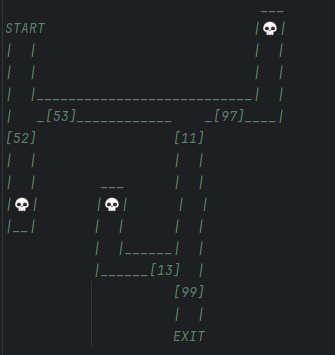

## Python Challenge Map:

### Escape the Labyrinth!

In this program, you are trying to escape a labyrinth by choosing the correct doors.

Each door has a two-digit number.

To decide if a door is part of the correct path, you must find the product of the 2 numbers on the door.

A door is considered correct if the product is odd and does not end in the number 3.

You will write code that checks each door and determines whether the path continues or fails.

If all stages pass, you successfully escape the labyrinth.

[52], [53], [11], [97], [99], and [13] are the door numbers that will be tested

